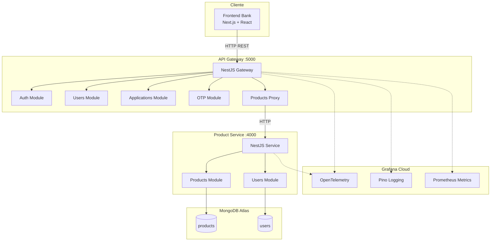
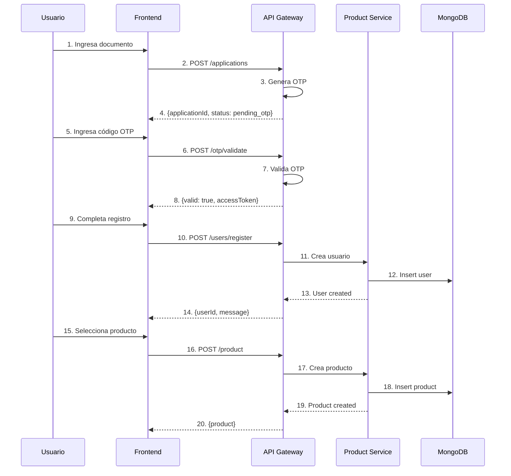
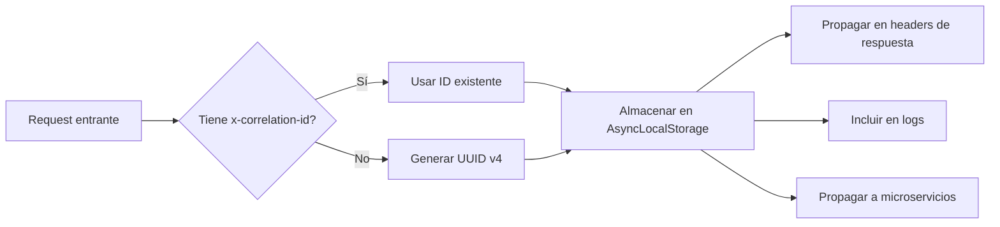
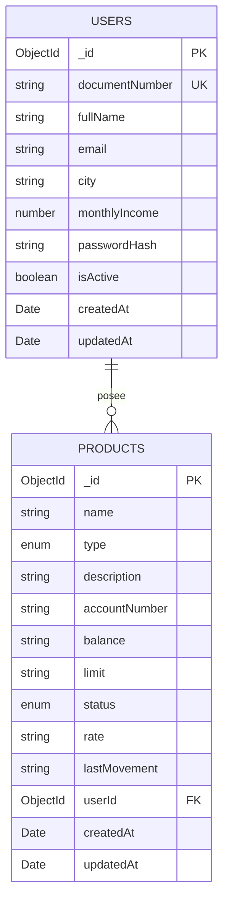

# Arquitectura del Sistema - Bank Application

## Tabla de Contenidos

- [Descripción General](#descripción-general)
- [Arquitectura del Sistema](#arquitectura-del-sistema)
- [Diagrama de Arquitectura](#diagrama-de-arquitectura)
- [Componentes del Sistema](#componentes-del-sistema)
- [Flujo de Datos](#flujo-de-datos)
- [Estructuras de Base de Datos](#estructuras-de-base-de-datos)
- [Endpoints API](#endpoints-api)
  - [Documentación Swagger](#documentación-swagger-openapi)
- [Patrones de Diseño](#patrones-de-diseño)
- [Configuración y Despliegue](#configuración-y-despliegue)

---

## Descripción General

Este proyecto es un **Sistema Bancario Digital** compuesto por una arquitectura de microservicios que permite a los usuarios:

- Solicitar productos bancarios (cuentas de ahorro, tarjetas de crédito, préstamos)
- Validar identidad mediante OTP (One-Time Password)
- Registrarse y autenticarse en el sistema
- Gestionar sus productos financieros

### Stack Tecnologico

| Componente | Tecnologia | Servicio/Version |
|------------|------------|------------------|
| Frontend | Next.js + React | 16.x / 19.x |
| API Gateway | NestJS | 11.x |
| Microservicio Products | NestJS + Mongoose | 11.x |
| Base de Datos | MongoDB Atlas | Cloud |
| Estado Frontend | Zustand | 5.x |
| Validacion | class-validator / Yup | - |
| Observabilidad | Grafana Cloud | Cloud |
| Metricas/Tracing | OpenTelemetry + Pino | - |

---

## Arquitectura del Sistema

```
┌─────────────────────────────────────────────────────────────────────────────┐
│                              CLIENTE (Browser)                              │
│                           Frontend Bank (Next.js)                           │
│                              Puerto: 3000                                    │
└─────────────────────────────────────┬───────────────────────────────────────┘
                                      │
                                      │ HTTP/REST
                                      │ x-correlation-id
                                      ▼
┌─────────────────────────────────────────────────────────────────────────────┐
│                              API GATEWAY                                     │
│                           NestJS Application                                │
│                              Puerto: 5000                                    │
│  ┌─────────────────────────────────────────────────────────────────────┐   │
│  │ Módulos:                                                              │   │
│  │  • Auth Module      → Autenticación y Login                          │   │
│  │  • Users Module     → Registro de usuarios                           │   │
│  │  • Applications     → Solicitudes de productos                       │   │
│  │  • OTP Module       → Validación de códigos OTP                      │   │
│  │  • Products Module  → Proxy a microservicio de productos            │   │
│  └─────────────────────────────────────────────────────────────────────┘   │
│  ┌─────────────────────────────────────────────────────────────────────┐   │
│  │ Características Transversales:                                        │   │
│  │  • Correlation ID   → Trazabilidad de requests                       │   │
│  │  • Rate Limiting    → Throttler (3/1s, 20/10s, 100/60s)              │   │
│  │  • Health Checks    → /health, /health/liveness, /health/readiness  │   │
│  │  • Logging          → Pino + OpenTelemetry                           │   │
│  │  • Security         → Helmet + CORS                                   │   │
│  └─────────────────────────────────────────────────────────────────────┘   │
└─────────────────────────────────────┬───────────────────────────────────────┘
                                      │
                                      │ HTTP/REST
                                      │
                                      ▼
┌─────────────────────────────────────────────────────────────────────────────┐
│                         MICROSERVICIO PRODUCTS                              │
│                           NestJS Application                                │
│                              Puerto: 4000                                    │
│  ┌─────────────────────────────────────────────────────────────────────┐   │
│  │ Módulos:                                                              │   │
│  │  • Products Module  → CRUD de productos                              │   │
│  │  • Users Module     → Gestión de usuarios                            │   │
│  │  • Auth Module      → Validación de tokens                           │   │
│  │  • Applications     → Estado de solicitudes                          │   │
│  └─────────────────────────────────────────────────────────────────────┘   │
└─────────────────────────────────────┬───────────────────────────────────────┘
                                      │
                                      │ Mongoose ODM
                                      ▼
┌─────────────────────────────────────────────────────────────────────────────┐
│                           MONGODB ATLAS                                      │
│                   Base de Datos NoSQL (Cloud)                               │
│  ┌─────────────────────────────────────────────────────────────────────┐   │
│  │ Colecciones:                                                          │   │
│  │  • users           → Información de usuarios                         │   │
│  │  • products        → Productos bancarios                             │   │
│  └─────────────────────────────────────────────────────────────────────┘   │
└─────────────────────────────────────────────────────────────────────────────┘
```

---

## Diagrama de Arquitectura



---

## Componentes del Sistema

### 1. Frontend Bank (Next.js)

**Puerto:** 3000

**Responsabilidades:**
- Interfaz de usuario para solicitud de productos
- Gestión de formularios con validación
- Manejo de estado global con Zustand
- Navegación entre flujos de aplicación

**Rutas Principales:**

| Ruta | Descripción |
|------|-------------|
| `/` | Landing page con productos destacados |
| `/inicio-sesion` | Login de usuarios existentes |
| `/creacion-usuario` | Registro de nuevos usuarios |
| `/inicio-solicitud` | Formulario para iniciar solicitud |
| `/validacion-otp` | Validación de código OTP |
| `/seleccion-producto` | Selección de producto bancario |
| `/resumen-solicitud` | Resumen de la solicitud |
| `/productos` | Dashboard de productos del usuario |

### 2. API Gateway (NestJS)

**Puerto:** 5000  
**Prefijo:** `/api-gateway/v1`

**Responsabilidades:**
- Punto de entrada único para el frontend
- Enrutamiento a microservicios
- Autenticación y autorización
- Rate limiting y throttling
- Logging centralizado
- Trazabilidad con Correlation ID

**Módulos:**

| Módulo | Endpoint Base | Descripción |
|--------|---------------|-------------|
| Auth | `/auth` | Autenticación (login) |
| Users | `/users` | Registro de usuarios |
| Applications | `/applications` | Gestión de solicitudes |
| OTP | `/otp` | Validación de códigos |
| Products | `/product` | Proxy a microservicio |

### 3. Microservicio Products (NestJS + MongoDB)

**Puerto:** 4000  
**Prefijo:** `/products`

**Responsabilidades:**
- CRUD completo de productos
- Persistencia en MongoDB
- Gestión de usuarios
- Validación de datos

---

## Flujo de Datos

### Flujo de Solicitud de Producto



### Correlation ID Flow



---

## Estructuras de Base de Datos

### Colección: `users`

```typescript
interface User {
  _id: ObjectId;                    // ID único de MongoDB
  documentNumber: string;           // Número de documento (cédula) - UNIQUE
  fullName: string;                 // Nombre completo del usuario
  email?: string;                   // Email (opcional, sparse unique)
  city: string;                     // Ciudad de residencia
  monthlyIncome: number;            // Ingresos mensuales en pesos
  passwordHash: string;             // Hash de la contraseña (bcrypt)
  isActive: boolean;                // Estado activo del usuario
  createdAt: Date;                  // Fecha de creación (auto)
  updatedAt: Date;                  // Fecha de actualización (auto)
}
```

**Índices:**
- `documentNumber`: Único, para búsquedas por cédula
- `email`: Sparse unique, para búsquedas opcionales

### Colección: `products`

```typescript
interface Product {
  _id: ObjectId;                    // ID único de MongoDB
  name: string;                     // Nombre del producto
  type: 'savings' | 'credit' | 'loan'; // Tipo de producto
  description?: string;             // Descripción del producto
  accountNumber?: string;           // Número de cuenta (auto-generado)
  balance: string;                  // Saldo actual (formato: "$X,XXX")
  limit?: string;                   // Límite de crédito (solo credit)
  status: 'active' | 'pending' | 'inactive'; // Estado del producto
  rate?: string;                    // Tasa de interés (ej: "4.5% EA")
  lastMovement?: string;            // Último movimiento
  userId?: ObjectId;                // Referencia al usuario propietario
  createdAt: Date;                  // Fecha de creación (auto)
  updatedAt: Date;                  // Fecha de actualización (auto)
}
```

**Índices:**
- `userId`: Para consultas de productos por usuario
- `userId + status`: Compuesto para filtrar productos activos

### Diagrama ER



---

## Endpoints API

### Documentación Swagger (OpenAPI)

Ambos servicios backend cuentan con documentación interactiva Swagger que permite explorar y probar todos los endpoints disponibles:

| Servicio | URL Swagger | Descripción |
|----------|-------------|-------------|
| API Gateway | http://localhost:5000/api | Documentación de autenticación, usuarios, OTP y solicitudes |
| Product Service | http://localhost:4000/api | Documentación de productos y gestión de catálogo |

> Nota: Los servicios deben estar en ejecución para acceder a la documentación Swagger.

---

### API Gateway (Puerto 5000)

#### Autenticación

| Método | Endpoint | Descripción |
|--------|----------|-------------|
| POST | `/api-gateway/v1/auth/login` | Iniciar sesión |

**Request Body:**
```json
{
  "documentNumber": "1234567890",
  "password": "SecurePass123!"
}
```

**Response:**
```json
{
  "accessToken": "eyJhbGciOiJIUzI1NiIs...",
  "fullName": "John Doe",
  "userId": "uuid-123",
  "isRegistered": true
}
```

#### Usuarios

| Método | Endpoint | Descripción |
|--------|----------|-------------|
| POST | `/api-gateway/v1/users/register` | Registrar nuevo usuario |

**Request Body:**
```json
{
  "documentNumber": "1234567890",
  "fullName": "Juan Pérez García",
  "city": "Bogotá",
  "monthlyIncome": 3500000,
  "password": "SecurePass123!"
}
```

#### Solicitudes

| Método | Endpoint | Descripción |
|--------|----------|-------------|
| POST | `/api-gateway/v1/applications` | Iniciar solicitud |

**Request Body:**
```json
{
  "documentNumber": "1234567890",
  "acceptsDataTreatment": true
}
```

#### OTP

| Método | Endpoint | Descripción |
|--------|----------|-------------|
| POST | `/api-gateway/v1/otp/validate` | Validar código OTP |
| POST | `/api-gateway/v1/otp/resend` | Reenviar código OTP |

**Request Body (validate):**
```json
{
  "otp": "123456"
}
```

#### Productos

| Método | Endpoint | Descripción |
|--------|----------|-------------|
| GET | `/api-gateway/v1/product/user/:userId` | Obtener productos del usuario |
| GET | `/api-gateway/v1/product/:id` | Obtener producto por ID |
| POST | `/api-gateway/v1/product` | Crear producto |
| PUT | `/api-gateway/v1/product/:id` | Actualizar producto |
| DELETE | `/api-gateway/v1/product/:id` | Eliminar producto |

#### Health Checks

| Método | Endpoint | Descripción |
|--------|----------|-------------|
| GET | `/health` | Estado general del servicio |
| GET | `/health/liveness` | Verificación de vida |
| GET | `/health/readiness` | Verificación de preparación |
| GET | `/metrics` | Métricas Prometheus |

---

## Patrones de Diseño

### 1. **Clean Architecture** (Arquitectura Limpia)

Cada módulo sigue la estructura:
```
module/
├── core/              # Casos de uso (lógica de negocio)
│   └── use-cases/
├── dto/               # Data Transfer Objects
├── repository/        # Interfaces y adaptadores de datos
└── services/          # Controladores HTTP
```

**Beneficio:** Separación de responsabilidades, testabilidad, independencia de frameworks.

### 2. **Repository Pattern**

```typescript
// Interface (puerto)
interface ProductsRepository {
  getProducts(): Promise<ProductResponseDto[]>;
  getProductById(id: string): Promise<ProductResponseDto>;
  createProduct(dto: CreateProductRequestDto): Promise<ProductResponseDto>;
}

// Implementación HTTP (adaptador para Gateway)
class ProductsRepositoryHttp implements ProductsRepository { }

// Implementación MongoDB (adaptador para Microservicio)
class ProductsRepositoryMongo implements ProductsRepository { }
```

**Beneficio:** Facilita cambiar la fuente de datos sin modificar la lógica de negocio.

### 3. **API Gateway Pattern**

El API Gateway actúa como punto de entrada único:
- Enrutamiento de requests
- Agregación de respuestas
- Autenticación centralizada
- Rate limiting
- Transformación de datos

### 4. **Correlation ID Pattern**

Implementado con `AsyncLocalStorage` para trazabilidad:
```typescript
// Middleware genera/propaga ID
correlationId = req.headers['x-correlation-id'] || uuidv4();

// Servicio accede al ID en cualquier punto
this.correlationIdService.getCorrelationId();
```

### 5. **Flux/Store Pattern** (Frontend)

Zustand para manejo de estado global:
```typescript
const useFormStore = create<FormSlice>()(
  persist(
    (...args) => ({
      ...createFormSlice(...args),
    }),
    {
      name: "bank-form-storage",
      storage: createJSONStorage(() => sessionStorage),
    }
  )
);
```

---

## Configuración y Despliegue

### Variables de Entorno

Las variables de entorno para cada servicio fueron enviadas por correo electronico:

- **API Gateway:** archivo `.env.api-gateway` (copiar como `.env` en la carpeta `api-gateway/`)
- **Product Service:** archivo `.env.product` (copiar como `.env` en la carpeta `product/`)

Las variables incluyen:
- URI de conexion a MongoDB Atlas (base de datos en la nube)
- Credenciales de Grafana Cloud para metricas y observabilidad
- Configuracion de JWT y CORS
- URLs de comunicacion entre servicios

**Nota:** No se requiere Docker ni instalacion local de MongoDB. La base de datos esta alojada en MongoDB Atlas y las metricas se envian a Grafana Cloud.

#### Frontend (.env.local)

El frontend no requiere archivo `.env` para desarrollo local. Por defecto se conecta a `http://localhost:5000`.

### Orden de Ejecucion

Para ejecutar el sistema completo, seguir este orden:

```bash
# Terminal 1 - Product Service (primero)
cd product
npm install
npm run start:dev

# Terminal 2 - API Gateway (segundo)
cd api-gateway
npm install
npm run start:dev

# Terminal 3 - Frontend (tercero)
cd frontend-bank
npm install
npm run dev
```

Verificar que los servicios estan corriendo:

```bash
curl http://localhost:4000/health   # Product Service
curl http://localhost:5000/health   # API Gateway
```

Luego abrir el navegador en `http://localhost:3000`

### Rate Limiting

El API Gateway implementa throttling con tres niveles:

| Nombre | TTL | Límite | Descripción |
|--------|-----|--------|-------------|
| short | 1s | 3 | Protección contra spam rápido |
| medium | 10s | 20 | Control de flujo normal |
| long | 60s | 100 | Límite por minuto |

### Seguridad

- **Helmet:** Headers de seguridad HTTP
- **CORS:** Configuración de orígenes permitidos
- **Validation Pipe:** Validación y sanitización de inputs
- **Rate Limiting:** Protección contra DDoS/spam
- **JWT:** Autenticación basada en tokens
- **bcrypt:** Hashing seguro de contraseñas

---

## Referencias

- [NestJS Documentation](https://docs.nestjs.com)
- [Next.js Documentation](https://nextjs.org/docs)
- [MongoDB Documentation](https://docs.mongodb.com)
- [Zustand Documentation](https://docs.pmnd.rs/zustand)
- [OpenTelemetry](https://opentelemetry.io/docs/)

---

*Documentación generada el 18 de febrero de 2026*
