# 🏛️ Arquitectura del Sistema - Bank Application

## Tabla de Contenidos

- [Descripción General](#descripción-general)
- [Arquitectura del Sistema](#arquitectura-del-sistema)
- [Diagrama de Arquitectura](#diagrama-de-arquitectura)
- [Componentes del Sistema](#componentes-del-sistema)
- [Flujo de Datos](#flujo-de-datos)
- [Estructuras de Base de Datos](#estructuras-de-base-de-datos)
- [Endpoints API](#endpoints-api)
- [Patrones de Diseño](#patrones-de-diseño)
- [Configuración y Despliegue](#configuración-y-despliegue)

---

## Descripción General

Este proyecto es un **Sistema Bancario Digital** compuesto por una arquitectura de microservicios que permite a los usuarios:

- Solicitar productos bancarios (cuentas de ahorro, tarjetas de crédito, préstamos)
- Validar identidad mediante OTP (One-Time Password)
- Registrarse y autenticarse en el sistema
- Gestionar sus productos financieros

### Stack Tecnológico

| Componente | Tecnología | Versión |
|------------|------------|---------|
| **Frontend** | Next.js + React | 16.x / 19.x |
| **API Gateway** | NestJS | 11.x |
| **Microservicio Products** | NestJS + MongoDB | 11.x |
| **Base de Datos** | MongoDB | 9.x |
| **Estado Frontend** | Zustand | 5.x |
| **Validación** | class-validator / Yup | - |
| **Observabilidad** | OpenTelemetry + Pino | - |

---

## Arquitectura del Sistema

```
┌─────────────────────────────────────────────────────────────────────────────┐
│                              CLIENTE (Browser)                              │
│                           Frontend Bank (Next.js)                           │
│                              Puerto: 3000                                    │
└─────────────────────────────────────┬───────────────────────────────────────┘
                                      │
                                      │ HTTP/REST
                                      │ x-correlation-id
                                      ▼
┌─────────────────────────────────────────────────────────────────────────────┐
│                              API GATEWAY                                     │
│                           NestJS Application                                │
│                              Puerto: 5000                                    │
│  ┌─────────────────────────────────────────────────────────────────────┐   │
│  │ Módulos:                                                              │   │
│  │  • Auth Module      → Autenticación y Login                          │   │
│  │  • Users Module     → Registro de usuarios                           │   │
│  │  • Applications     → Solicitudes de productos                       │   │
│  │  • OTP Module       → Validación de códigos OTP                      │   │
│  │  • Products Module  → Proxy a microservicio de productos            │   │
│  └─────────────────────────────────────────────────────────────────────┘   │
│  ┌─────────────────────────────────────────────────────────────────────┐   │
│  │ Características Transversales:                                        │   │
│  │  • Correlation ID   → Trazabilidad de requests                       │   │
│  │  • Rate Limiting    → Throttler (3/1s, 20/10s, 100/60s)              │   │
│  │  • Health Checks    → /health, /health/liveness, /health/readiness  │   │
│  │  • Logging          → Pino + OpenTelemetry                           │   │
│  │  • Security         → Helmet + CORS                                   │   │
│  └─────────────────────────────────────────────────────────────────────┘   │
└─────────────────────────────────────┬───────────────────────────────────────┘
                                      │
                                      │ HTTP/REST
                                      │
                                      ▼
┌─────────────────────────────────────────────────────────────────────────────┐
│                         MICROSERVICIO PRODUCTS                              │
│                           NestJS Application                                │
│                              Puerto: 4000                                    │
│  ┌─────────────────────────────────────────────────────────────────────┐   │
│  │ Módulos:                                                              │   │
│  │  • Products Module  → CRUD de productos                              │   │
│  │  • Users Module     → Gestión de usuarios                            │   │
│  │  • Auth Module      → Validación de tokens                           │   │
│  │  • Applications     → Estado de solicitudes                          │   │
│  └─────────────────────────────────────────────────────────────────────┘   │
└─────────────────────────────────────┬───────────────────────────────────────┘
                                      │
                                      │ Mongoose ODM
                                      ▼
┌─────────────────────────────────────────────────────────────────────────────┐
│                              MONGODB                                         │
│                        Base de Datos NoSQL                                  │
│  ┌─────────────────────────────────────────────────────────────────────┐   │
│  │ Colecciones:                                                          │   │
│  │  • users           → Información de usuarios                         │   │
│  │  • products        → Productos bancarios                             │   │
│  └─────────────────────────────────────────────────────────────────────┘   │
└─────────────────────────────────────────────────────────────────────────────┘
```

---

## Diagrama de Arquitectura

```mermaid
graph TB
    subgraph Cliente["🖥️ Cliente"]
        FE[Frontend Bank<br/>Next.js + React]
    end

    subgraph Gateway["🚪 API Gateway :5000"]
        GW[NestJS Gateway]
        AUTH[Auth Module]
        USERS[Users Module]
        APPS[Applications Module]
        OTP[OTP Module]
        PROD_PROXY[Products Proxy]
        
        GW --> AUTH
        GW --> USERS
        GW --> APPS
        GW --> OTP
        GW --> PROD_PROXY
    end

    subgraph ProductService["📦 Product Service :4000"]
        PS[NestJS Service]
        PS_PROD[Products Module]
        PS_USERS[Users Module]
        
        PS --> PS_PROD
        PS --> PS_USERS
    end

    subgraph Database["🗄️ MongoDB"]
        USERS_COL[(users)]
        PRODUCTS_COL[(products)]
    end

    subgraph Observability["📊 Observabilidad"]
        OTEL[OpenTelemetry]
        PINO[Pino Logging]
        PROM[Prometheus Metrics]
    end

    FE -->|HTTP REST| GW
    PROD_PROXY -->|HTTP| PS
    PS_PROD --> PRODUCTS_COL
    PS_USERS --> USERS_COL
    
    GW -.-> OTEL
    GW -.-> PINO
    GW -.-> PROM
    PS -.-> OTEL
```



---

## Componentes del Sistema

### 1. Frontend Bank (Next.js)

**Puerto:** 3000

**Responsabilidades:**
- Interfaz de usuario para solicitud de productos
- Gestión de formularios con validación
- Manejo de estado global con Zustand
- Navegación entre flujos de aplicación

**Rutas Principales:**

| Ruta | Descripción |
|------|-------------|
| `/` | Landing page con productos destacados |
| `/inicio-sesion` | Login de usuarios existentes |
| `/creacion-usuario` | Registro de nuevos usuarios |
| `/inicio-solicitud` | Formulario para iniciar solicitud |
| `/validacion-otp` | Validación de código OTP |
| `/seleccion-producto` | Selección de producto bancario |
| `/resumen-solicitud` | Resumen de la solicitud |
| `/productos` | Dashboard de productos del usuario |

### 2. API Gateway (NestJS)

**Puerto:** 5000  
**Prefijo:** `/api-gateway/v1`

**Responsabilidades:**
- Punto de entrada único para el frontend
- Enrutamiento a microservicios
- Autenticación y autorización
- Rate limiting y throttling
- Logging centralizado
- Trazabilidad con Correlation ID

**Módulos:**

| Módulo | Endpoint Base | Descripción |
|--------|---------------|-------------|
| Auth | `/auth` | Autenticación (login) |
| Users | `/users` | Registro de usuarios |
| Applications | `/applications` | Gestión de solicitudes |
| OTP | `/otp` | Validación de códigos |
| Products | `/product` | Proxy a microservicio |

### 3. Microservicio Products (NestJS + MongoDB)

**Puerto:** 4000  
**Prefijo:** `/products`

**Responsabilidades:**
- CRUD completo de productos
- Persistencia en MongoDB
- Gestión de usuarios
- Validación de datos

---

## Flujo de Datos

### Flujo de Solicitud de Producto

```mermaid
sequenceDiagram
    participant U as Usuario
    participant FE as Frontend
    participant GW as API Gateway
    participant PS as Product Service
    participant DB as MongoDB

    U->>FE: 1. Ingresa documento
    FE->>GW: 2. POST /applications
    GW->>GW: 3. Genera OTP
    GW-->>FE: 4. {applicationId, status: pending_otp}
    
    U->>FE: 5. Ingresa código OTP
    FE->>GW: 6. POST /otp/validate
    GW->>GW: 7. Valida OTP
    GW-->>FE: 8. {valid: true, accessToken}
    
    U->>FE: 9. Completa registro
    FE->>GW: 10. POST /users/register
    GW->>PS: 11. Crea usuario
    PS->>DB: 12. Insert user
    PS-->>GW: 13. User created
    GW-->>FE: 14. {userId, message}
    
    U->>FE: 15. Selecciona producto
    FE->>GW: 16. POST /product
    GW->>PS: 17. Crea producto
    PS->>DB: 18. Insert product
    PS-->>GW: 19. Product created
    GW-->>FE: 20. {product}
```



### Correlation ID Flow


---

## Estructuras de Base de Datos

### Colección: `users`

```typescript
interface User {
  _id: ObjectId;                    // ID único de MongoDB
  documentNumber: string;           // Número de documento (cédula) - UNIQUE
  fullName: string;                 // Nombre completo del usuario
  email?: string;                   // Email (opcional, sparse unique)
  city: string;                     // Ciudad de residencia
  monthlyIncome: number;            // Ingresos mensuales en pesos
  passwordHash: string;             // Hash de la contraseña (bcrypt)
  isActive: boolean;                // Estado activo del usuario
  createdAt: Date;                  // Fecha de creación (auto)
  updatedAt: Date;                  // Fecha de actualización (auto)
}
```

**Índices:**
- `documentNumber`: Único, para búsquedas por cédula
- `email`: Sparse unique, para búsquedas opcionales

### Colección: `products`

```typescript
interface Product {
  _id: ObjectId;                    // ID único de MongoDB
  name: string;                     // Nombre del producto
  type: 'savings' | 'credit' | 'loan'; // Tipo de producto
  description?: string;             // Descripción del producto
  accountNumber?: string;           // Número de cuenta (auto-generado)
  balance: string;                  // Saldo actual (formato: "$X,XXX")
  limit?: string;                   // Límite de crédito (solo credit)
  status: 'active' | 'pending' | 'inactive'; // Estado del producto
  rate?: string;                    // Tasa de interés (ej: "4.5% EA")
  lastMovement?: string;            // Último movimiento
  userId?: ObjectId;                // Referencia al usuario propietario
  createdAt: Date;                  // Fecha de creación (auto)
  updatedAt: Date;                  // Fecha de actualización (auto)
}
```

**Índices:**
- `userId`: Para consultas de productos por usuario
- `userId + status`: Compuesto para filtrar productos activos

### Diagrama ER


---

## Endpoints API

### API Gateway (Puerto 5000)

#### Autenticación

| Método | Endpoint | Descripción |
|--------|----------|-------------|
| POST | `/api-gateway/v1/auth/login` | Iniciar sesión |

**Request Body:**
```json
{
  "documentNumber": "1234567890",
  "password": "SecurePass123!"
}
```

**Response:**
```json
{
  "accessToken": "eyJhbGciOiJIUzI1NiIs...",
  "fullName": "John Doe",
  "userId": "uuid-123",
  "isRegistered": true
}
```

#### Usuarios

| Método | Endpoint | Descripción |
|--------|----------|-------------|
| POST | `/api-gateway/v1/users/register` | Registrar nuevo usuario |

**Request Body:**
```json
{
  "documentNumber": "1234567890",
  "fullName": "Juan Pérez García",
  "city": "Bogotá",
  "monthlyIncome": 3500000,
  "password": "SecurePass123!"
}
```

#### Solicitudes

| Método | Endpoint | Descripción |
|--------|----------|-------------|
| POST | `/api-gateway/v1/applications` | Iniciar solicitud |

**Request Body:**
```json
{
  "documentNumber": "1234567890",
  "acceptsDataTreatment": true
}
```

#### OTP

| Método | Endpoint | Descripción |
|--------|----------|-------------|
| POST | `/api-gateway/v1/otp/validate` | Validar código OTP |
| POST | `/api-gateway/v1/otp/resend` | Reenviar código OTP |

**Request Body (validate):**
```json
{
  "otp": "123456"
}
```

#### Productos

| Método | Endpoint | Descripción |
|--------|----------|-------------|
| GET | `/api-gateway/v1/product/user/:userId` | Obtener productos del usuario |
| GET | `/api-gateway/v1/product/:id` | Obtener producto por ID |
| POST | `/api-gateway/v1/product` | Crear producto |
| PUT | `/api-gateway/v1/product/:id` | Actualizar producto |
| DELETE | `/api-gateway/v1/product/:id` | Eliminar producto |

#### Health Checks

| Método | Endpoint | Descripción |
|--------|----------|-------------|
| GET | `/health` | Estado general del servicio |
| GET | `/health/liveness` | Verificación de vida |
| GET | `/health/readiness` | Verificación de preparación |
| GET | `/metrics` | Métricas Prometheus |

---

## Patrones de Diseño

### 1. **Clean Architecture** (Arquitectura Limpia)

Cada módulo sigue la estructura:
```
module/
├── core/              # Casos de uso (lógica de negocio)
│   └── use-cases/
├── dto/               # Data Transfer Objects
├── repository/        # Interfaces y adaptadores de datos
└── services/          # Controladores HTTP
```

**Beneficio:** Separación de responsabilidades, testabilidad, independencia de frameworks.

### 2. **Repository Pattern**

```typescript
// Interface (puerto)
interface ProductsRepository {
  getProducts(): Promise<ProductResponseDto[]>;
  getProductById(id: string): Promise<ProductResponseDto>;
  createProduct(dto: CreateProductRequestDto): Promise<ProductResponseDto>;
}

// Implementación HTTP (adaptador para Gateway)
class ProductsRepositoryHttp implements ProductsRepository { }

// Implementación MongoDB (adaptador para Microservicio)
class ProductsRepositoryMongo implements ProductsRepository { }
```

**Beneficio:** Facilita cambiar la fuente de datos sin modificar la lógica de negocio.

### 3. **API Gateway Pattern**

El API Gateway actúa como punto de entrada único:
- Enrutamiento de requests
- Agregación de respuestas
- Autenticación centralizada
- Rate limiting
- Transformación de datos

### 4. **Correlation ID Pattern**

Implementado con `AsyncLocalStorage` para trazabilidad:
```typescript
// Middleware genera/propaga ID
correlationId = req.headers['x-correlation-id'] || uuidv4();

// Servicio accede al ID en cualquier punto
this.correlationIdService.getCorrelationId();
```

### 5. **Flux/Store Pattern** (Frontend)

Zustand para manejo de estado global:
```typescript
const useFormStore = create<FormSlice>()(
  persist(
    (...args) => ({
      ...createFormSlice(...args),
    }),
    {
      name: "bank-form-storage",
      storage: createJSONStorage(() => sessionStorage),
    }
  )
);
```

---

## Configuración y Despliegue

### Variables de Entorno

#### API Gateway (.env)

```env
# Server
PORT=5000
NODE_ENV=development

# CORS
CORS_ORIGINS=http://localhost:3000

# JWT
JWT_SECRET=your-super-secret-key
JWT_EXPIRATION=24h

# Microservices
PRODUCTS_SERVICE_URL=http://localhost:4000
```

#### Product Service (.env)

```env
# Server
PORT=4000
NODE_ENV=development

# MongoDB
MONGODB_URI=mongodb://localhost:27017/bank-products

# CORS
CORS_ORIGINS=http://localhost:5000

# JWT
JWT_SECRET=your-super-secret-key
```

#### Frontend (.env.local)

```env
NEXT_PUBLIC_API_URL=http://localhost:5000
```

### Scripts de Desarrollo

```bash
# Frontend (puerto 3000)
cd frontend-bank && npm run dev

# API Gateway (puerto 5000)
cd api-gateway && npm run start:dev

# Product Service (puerto 4000)
cd product && npm run start:dev
```

### Rate Limiting

El API Gateway implementa throttling con tres niveles:

| Nombre | TTL | Límite | Descripción |
|--------|-----|--------|-------------|
| short | 1s | 3 | Protección contra spam rápido |
| medium | 10s | 20 | Control de flujo normal |
| long | 60s | 100 | Límite por minuto |

### Seguridad

- **Helmet:** Headers de seguridad HTTP
- **CORS:** Configuración de orígenes permitidos
- **Validation Pipe:** Validación y sanitización de inputs
- **Rate Limiting:** Protección contra DDoS/spam
- **JWT:** Autenticación basada en tokens
- **bcrypt:** Hashing seguro de contraseñas

---

## Referencias

- [NestJS Documentation](https://docs.nestjs.com)
- [Next.js Documentation](https://nextjs.org/docs)
- [MongoDB Documentation](https://docs.mongodb.com)
- [Zustand Documentation](https://docs.pmnd.rs/zustand)
- [OpenTelemetry](https://opentelemetry.io/docs/)

---

*Documentación generada el 18 de febrero de 2026*
