# 🏦 Frontend Bank - Documentación Técnica

## Tabla de Contenidos

- [Descripción General](#descripción-general)
- [Arquitectura del Proyecto](#arquitectura-del-proyecto)
- [Rutas y Navegación](#rutas-y-navegación)
- [Componentes](#componentes)
- [Estado Global (Zustand)](#estado-global-zustand)
- [Integración con API](#integración-con-api)
- [Flujo de Usuario](#flujo-de-usuario)
- [Estilos y UI](#estilos-y-ui)
- [Testing](#testing)
- [Configuración](#configuración)
- [Desarrollo](#desarrollo)

---

## Descripción General

El **Frontend Bank** es una aplicación web moderna para solicitud y gestión de productos bancarios. Implementada con **Next.js 16** y **React 19**, proporciona:

- Interfaz intuitiva para solicitud de productos bancarios
- Flujo guiado de registro y verificación OTP
- Dashboard de productos del usuario
- Gestión de estado persistente con Zustand

### Información del Proyecto

| Propiedad | Valor |
|-----------|-------|
| **Nombre** | frontend-bank |
| **Puerto** | 3000 |
| **Framework** | Next.js 16 |
| **UI Library** | React 19 |
| **Estilos** | Tailwind CSS 4 |
| **Estado** | Zustand 5 |
| **Forms** | React Hook Form + Yup |

---

## Arquitectura del Proyecto

```
frontend-bank/
├── public/
│   └── cards/                     # Imágenes de tarjetas
├── src/
│   ├── app/                       # App Router de Next.js
│   │   ├── globals.css            # Estilos globales
│   │   ├── layout.tsx             # Layout principal
│   │   └── (features)/            # Páginas agrupadas
│   │       ├── (landing)/         # Página principal
│   │       ├── inicio-sesion/     # Login
│   │       ├── creacion-usuario/  # Registro
│   │       ├── inicio-solicitud/  # Iniciar solicitud
│   │       ├── validacion-otp/    # Validación OTP
│   │       ├── seleccion-producto/# Selección de producto
│   │       ├── resumen-solicitud/ # Resumen
│   │       └── productos/         # Dashboard de productos
│   ├── config/
│   │   ├── axios.instance.ts      # Cliente HTTP configurado
│   │   └── endpoints.ts           # URLs de la API
│   ├── routes/
│   │   └── index.ts               # Definición de rutas
│   └── shared/
│       ├── components/            # Componentes reutilizables
│       ├── constants/             # Constantes
│       ├── hooks/                 # Custom hooks
│       ├── store/                 # Estado global (Zustand)
│       └── utils/                 # Utilidades
└── test/
```

### Estructura de Cada Feature

```
(feature)/
├── page.tsx                       # Página principal
├── components/                    # Componentes específicos
│   ├── feature-form/
│   └── feature-card/
├── constants/                     # Constantes locales
├── hooks/                         # Hooks específicos
├── interfaces/                    # Tipos TypeScript
├── services/                      # Llamadas a API
└── utils/                         # Utilidades locales
```

---

## Rutas y Navegación

### Definición de Rutas

```typescript
// routes/index.ts
const ROUTES = {
  HOME: "/",                       // Landing page
  LOGIN: "/inicio-sesion",         // Login
  CREATE_USER: "/creacion-usuario", // Registro
  REQUEST_PRODUCT: "/inicio-solicitud", // Iniciar solicitud
  SELECT_PRODUCT: "/seleccion-producto", // Selección
  OTP_VALIDATE: "/validacion-otp", // Validación OTP
  PRODUCTS: "/productos",          // Dashboard
  APPLICATION_SUMMARY: "/resumen-solicitud", // Resumen
};
```

### Diagrama de Navegación


### Páginas

| Ruta | Componente | Descripción |
|------|------------|-------------|
| `/` | `Home` | Landing page con hero y productos destacados |
| `/inicio-sesion` | `LoginPage` | Formulario de inicio de sesión |
| `/creacion-usuario` | `CreateUserPage` | Formulario de registro |
| `/inicio-solicitud` | `ApplicationStartPage` | Inicio de solicitud de producto |
| `/validacion-otp` | `OtpValidationPage` | Validación de código OTP |
| `/seleccion-producto` | `ProductSelectionPage` | Selección de tipo de producto |
| `/resumen-solicitud` | `ApplicationSummaryPage` | Resumen de la solicitud |
| `/productos` | `ProductListPage` | Dashboard de productos |

---

## Componentes

### Componentes Compartidos

```
shared/components/
├── autocomplete/         # Input con autocompletado
├── button/               # Botones estilizados
├── checkbox/             # Checkboxes personalizados
├── container/            # Contenedores de layout
├── footer/               # Footer de la aplicación
├── header/               # Header/navbar
├── icons/                # Iconos SVG como componentes
├── input/                # Inputs de formulario
├── loader/               # Spinners y loaders
├── modal/                # Modales reutilizables
├── page-background/      # Fondos decorativos
├── security-badge/       # Badge de seguridad
├── select/               # Selects personalizados
├── stepper/              # Indicador de pasos
├── submit-button/        # Botón de envío
└── toast/                # Notificaciones
```

### Ejemplo de Componente

```tsx
// shared/components/button/button.tsx
interface ButtonProps {
  variant?: 'primary' | 'secondary' | 'outline';
  size?: 'sm' | 'md' | 'lg';
  disabled?: boolean;
  loading?: boolean;
  children: React.ReactNode;
  onClick?: () => void;
}

export default function Button({
  variant = 'primary',
  size = 'md',
  disabled,
  loading,
  children,
  onClick,
}: ButtonProps) {
  return (
    <button
      className={cn(
        'rounded-lg font-medium transition-all',
        variants[variant],
        sizes[size],
        disabled && 'opacity-50 cursor-not-allowed'
      )}
      disabled={disabled || loading}
      onClick={onClick}
    >
      {loading ? <Loader /> : children}
    </button>
  );
}
```

### Componentes de Feature

Cada feature tiene sus propios componentes específicos:

```tsx
// (features)/productos/components/
├── ProductsHeader/       # Header con información del usuario
├── ProductTabs/          # Tabs de filtro (todos, ahorro, crédito)
├── ProductSection/       # Sección de productos por tipo
├── ProductCard/          # Tarjeta de producto individual
└── CancelProductModal/   # Modal de cancelación
```

---

## Estado Global (Zustand)

### Configuración del Store

```typescript
// shared/store/form.store.ts
import { create } from "zustand";
import { persist, createJSONStorage } from "zustand/middleware";
import { createFormSlice, type FormSlice } from "./slices/form.slice";

export const useFormStore = create<FormSlice>()(
  persist(
    (...args) => ({
      ...createFormSlice(...args),
    }),
    {
      name: "bank-form-storage",
      storage: createJSONStorage(() => sessionStorage),
      partialize: (state) => ({
        login: state.login,
        register: state.register,
        application: state.application,
        productSelection: state.productSelection,
        registerResponse: state.registerResponse,
        loginResponse: state.loginResponse,
      }),
    }
  )
);
```

### Form Slice

```typescript
// shared/store/slices/form.slice.ts

// Estados de formularios
export interface LoginFormState {
  documentNumber: string;
}

export interface RegisterFormState {
  fullName: string;
  city: string;
  monthlyIncome: number | null;
}

export interface ApplicationFormState {
  documentNumber: string;
  acceptsDataTreatment: boolean;
}

export interface ProductSelectionState {
  selectedProductId: string | null;
}

// Respuestas de API
export interface RegisterResponseState {
  preClientId: string;
  [key: string]: unknown;
}

export interface LoginResponseState {
  accessToken: string;
  fullName: string;
  userId: string;
  isRegistered: boolean;
}

// Acciones
export interface FormActions {
  setLoginField: <K extends keyof LoginFormState>(
    field: K,
    value: LoginFormState[K]
  ) => void;
  setRegisterField: <K extends keyof RegisterFormState>(
    field: K,
    value: RegisterFormState[K]
  ) => void;
  setApplicationField: <K extends keyof ApplicationFormState>(
    field: K,
    value: ApplicationFormState[K]
  ) => void;
  setSelectedProduct: (productId: string | null) => void;
  setRegisterResponse: (response: RegisterResponseState) => void;
  setLoginResponse: (response: LoginResponseState) => void;
  resetLogin: () => void;
  resetRegister: () => void;
  resetApplication: () => void;
  resetProductSelection: () => void;
  resetAllForms: () => void;
}
```

### Uso del Store

```tsx
// En un componente
import { useFormStore } from "@/shared/store";

function LoginForm() {
  const { login, setLoginField, setLoginResponse } = useFormStore();

  const handleSubmit = async (data) => {
    const response = await loginService(data);
    setLoginResponse(response);
  };

  return (
    <input
      value={login.documentNumber}
      onChange={(e) => setLoginField("documentNumber", e.target.value)}
    />
  );
}
```

---

## Integración con API

### Cliente Axios

```typescript
// config/axios.instance.ts
import axios from "axios";

const API_BASE_URL = process.env.NEXT_PUBLIC_API_URL || "http://localhost:5000";
const CORRELATION_ID_KEY = "x-correlation-id";

export const api = axios.create({
  baseURL: API_BASE_URL,
  timeout: 10000,
  headers: {
    "Content-Type": "application/json",
  },
  withCredentials: false,
});

// Interceptor de Request: agrega Correlation ID
api.interceptors.request.use((config) => {
  if (typeof window !== "undefined") {
    const correlationId = sessionStorage.getItem(CORRELATION_ID_KEY);
    if (correlationId) {
      config.headers[CORRELATION_ID_KEY] = correlationId;
    }
  }
  return config;
});

// Interceptor de Response: guarda Correlation ID
api.interceptors.response.use(
  (response) => {
    const correlationId =
      response.headers[CORRELATION_ID_KEY] ||
      response.data?.correlationId;

    if (correlationId && typeof window !== "undefined") {
      sessionStorage.setItem(CORRELATION_ID_KEY, correlationId);
    }

    return response.data;
  },
  (error) => {
    const message = error.response?.data?.message || "Connection error";
    console.error(`[API Error]: ${message}`);
    return Promise.reject(error);
  }
);

// Métodos helpers
export async function post<T>(endpoint: string, body: object): Promise<T> {
  return api.post(endpoint, body);
}

export async function get<T>(endpoint: string): Promise<T> {
  return api.get(endpoint);
}

export async function put<T>(endpoint: string, body: object): Promise<T> {
  return api.put(endpoint, body);
}

export async function del<T>(endpoint: string): Promise<T> {
  return api.delete(endpoint);
}
```

### Endpoints

```typescript
// config/endpoints.ts
const ENDPOINTS = {
  "start-application": "/api-gateway/v1/applications",
  "otp-validate": "/api-gateway/v1/otp/validate",
  "create-pre-client": "/api-gateway/v1/users/register",
  "create-product": "/api-gateway/v1/product",
  login: "/api-gateway/v1/auth/login",
  products: "/api-gateway/v1/product/user",
  "products-crud": "/api-gateway/v1/product",
};

export default ENDPOINTS;
```

### Servicios por Feature

```typescript
// (features)/productos/services/products.service.ts
import { get, put, del } from "@/config/axios.instance";
import ENDPOINTS from "@/config/endpoints";

export const getProductsByUser = async (userId: string) => {
  return get(`${ENDPOINTS.products}/${userId}`);
};

export const updateProduct = async (id: string, data: UpdateProductDto) => {
  return put(`${ENDPOINTS["products-crud"]}/${id}`, data);
};

export const deleteProduct = async (id: string) => {
  return del(`${ENDPOINTS["products-crud"]}/${id}`);
};
```

---

## Flujo de Usuario

### Flujo de Nueva Solicitud

```mermaid
sequenceDiagram
    participant U as Usuario
    participant L as Landing
    participant A as Solicitud
    participant O as OTP
    participant R as Registro
    participant S as Selección
    participant P as Productos

    U->>L: Visita landing
    L->>A: Click "Solicitar"
    A->>A: Ingresa documento + acepta términos
    A->>O: POST /applications → Envía OTP
    O->>O: Ingresa código OTP
    O->>R: Valida OTP → Muestra registro
    R->>R: Completa datos personales
    R->>S: POST /users/register → Selecciona producto
    S->>S: Elige tipo de producto
    S->>P: POST /product → Dashboard
    P->>P: Ve sus productos
```



### Flujo de Login

```mermaid
sequenceDiagram
    participant U as Usuario
    participant L as Login
    participant D as Dashboard

    U->>L: Ingresa documento + contraseña
    L->>L: POST /auth/login
    L->>D: Redirect con token
    D->>D: GET /product/user/:userId
    D->>D: Muestra productos
```



---

## Estilos y UI

### Configuración de Tailwind

```typescript
// tailwind.config.ts
import type { Config } from "tailwindcss";

const config: Config = {
  content: [
    "./src/pages/**/*.{js,ts,jsx,tsx,mdx}",
    "./src/components/**/*.{js,ts,jsx,tsx,mdx}",
    "./src/app/**/*.{js,ts,jsx,tsx,mdx}",
  ],
  theme: {
    extend: {
      colors: {
        primary: {
          50: '#eff6ff',
          500: '#3b82f6',
          600: '#2563eb',
          700: '#1d4ed8',
        },
        // ... más colores
      },
      animation: {
        'fade-in-up': 'fadeInUp 0.5s ease-out',
        'slide-in': 'slideIn 0.3s ease-out',
      },
    },
  },
  plugins: [],
};

export default config;
```

### Fuentes

```tsx
// app/layout.tsx
import { Geist, Geist_Mono } from "next/font/google";

const geistSans = Geist({
  variable: "--font-geist-sans",
  subsets: ["latin"],
});

const geistMono = Geist_Mono({
  variable: "--font-geist-mono",
  subsets: ["latin"],
});
```

### Componentes de UI

| Componente | Descripción |
|------------|-------------|
| `PageBackground` | Fondo con gradientes y decoraciones |
| `Header` | Navegación principal |
| `Footer` | Pie de página |
| `Loader` | Spinner de carga |
| `Modal` | Diálogos modales |
| `Toast` | Notificaciones |

---

## Testing

### Configuración de Jest

```typescript
// jest.config.ts
import type { Config } from "jest";
import nextJest from "next/jest";

const createJestConfig = nextJest({
  dir: "./",
});

const config: Config = {
  coverageProvider: "v8",
  testEnvironment: "jsdom",
  setupFilesAfterEnv: ["<rootDir>/jest.setup.ts"],
  moduleNameMapper: {
    "^@/(.*)$": "<rootDir>/src/$1",
  },
};

export default createJestConfig(config);
```

### Ejecutar Tests

```bash
# Tests unitarios
npm run test

# Tests con watch mode
npm run test:watch

# Tests con coverage
npm run test:coverage
```

### Ejemplo de Test

```typescript
// shared/store/form.store.test.ts
import { useFormStore } from "./form.store";

describe("FormStore", () => {
  beforeEach(() => {
    useFormStore.getState().resetAllForms();
  });

  it("should update login field", () => {
    const { setLoginField } = useFormStore.getState();
    
    setLoginField("documentNumber", "123456789");
    
    expect(useFormStore.getState().login.documentNumber).toBe("123456789");
  });

  it("should reset all forms", () => {
    const { setLoginField, resetAllForms } = useFormStore.getState();
    
    setLoginField("documentNumber", "123456789");
    resetAllForms();
    
    expect(useFormStore.getState().login.documentNumber).toBe("");
  });
});
```

---

## Configuración

### Variables de Entorno

```env
# .env.local
NEXT_PUBLIC_API_URL=http://localhost:5000
```

### Next.js Config

```typescript
// next.config.ts
import type { NextConfig } from "next";

const nextConfig: NextConfig = {
  reactStrictMode: true,
  experimental: {
    // Experimental features si es necesario
  },
  images: {
    domains: ['localhost'],
  },
};

export default nextConfig;
```

---

## Desarrollo

### Scripts Disponibles

```bash
# Desarrollo
npm run dev             # Servidor de desarrollo

# Producción
npm run build           # Build de producción
npm run start           # Servidor de producción

# Calidad
npm run lint            # ESLint
npm run test            # Jest
npm run test:coverage   # Coverage report
```

### Agregar Nueva Feature

1. **Crear estructura de carpetas:**
```bash
mkdir -p src/app/(features)/nueva-feature/{components,services,hooks,interfaces,constants}
```

2. **Crear página:**
```tsx
// src/app/(features)/nueva-feature/page.tsx
"use client";

import { PageBackground } from "@/shared/components/page-background";
import { NuevaFeatureForm } from "./components";

export default function NuevaFeaturePage() {
  return (
    <main className="min-h-screen">
      <PageBackground variant="light" />
      <NuevaFeatureForm />
    </main>
  );
}
```

3. **Agregar ruta:**
```typescript
// routes/index.ts
const ROUTES = {
  // ... rutas existentes
  NUEVA_FEATURE: "/nueva-feature",
};
```

4. **Crear servicio:**
```typescript
// nueva-feature/services/nueva-feature.service.ts
import { post } from "@/config/axios.instance";

export const nuevaFeatureApi = async (data: NuevaFeatureDto) => {
  return post("/api-gateway/v1/nueva-feature", data);
};
```

---

## Dependencias Principales

| Paquete | Versión | Propósito |
|---------|---------|-----------|
| `next` | 16.1.6 | Framework React |
| `react` | 19.2.3 | UI Library |
| `zustand` | ^5.0.11 | State management |
| `axios` | ^1.13.5 | Cliente HTTP |
| `react-hook-form` | ^7.71.1 | Gestión de formularios |
| `@hookform/resolvers` | ^5.2.2 | Validación con Yup |
| `yup` | ^1.7.1 | Schema validation |
| `tailwindcss` | ^4 | Estilos CSS |

---

## Capturas de Pantalla

### Landing Page
- Hero con llamado a la acción
- Sección de productos destacados
- Footer informativo

### Dashboard de Productos
- Tabs de filtrado (Todos, Ahorro, Crédito, Préstamos)
- Tarjetas de producto con información
- Acciones de editar/cancelar

### Formularios
- Validación en tiempo real
- Feedback visual de errores
- Loader durante envío

---

*Documentación actualizada: 18 de febrero de 2026*
