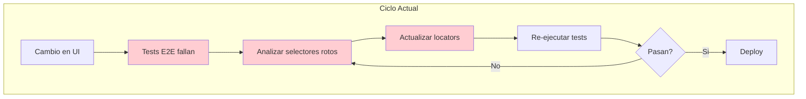
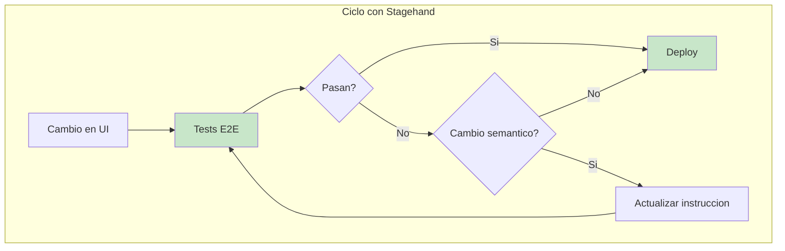
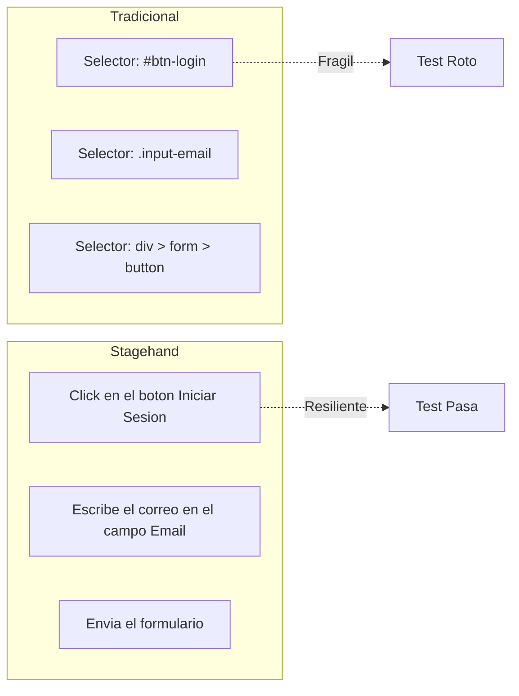
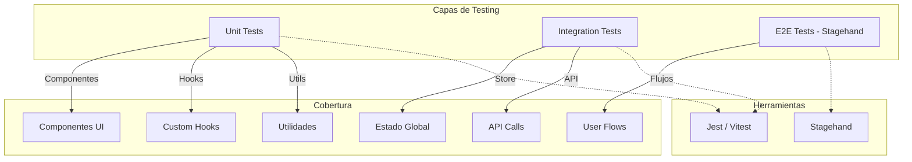
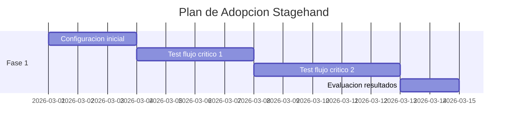

# Estrategia de Pruebas E2E con Stagehand

## Resumen Ejecutivo

Este documento presenta una estrategia de pruebas end-to-end basada en **Stagehand**, un framework de automatizacion que utiliza interaccion semantica en lugar de selectores. El objetivo es reducir el costo de mantenimiento de pruebas automatizadas ante cambios frecuentes en la interfaz de usuario.

---

## Tabla de Contenidos

- [Problema Actual](#problema-actual)
- [Solucion Propuesta](#solucion-propuesta)
- [Comparativa de Enfoques](#comparativa-de-enfoques)
- [Arquitectura de Pruebas](#arquitectura-de-pruebas)
- [Implementacion con Stagehand](#implementacion-con-stagehand)
- [Plan de Adopcion](#plan-de-adopcion)

---

## Problema Actual

Las pruebas E2E tradicionales basadas en selectores presentan los siguientes problemas:

| Problema | Impacto |
|----------|---------|
| Dependencia de selectores CSS/XPath | Cada cambio en la UI requiere actualizar los tests |
| Fragilidad ante refactors | Un cambio de clase o ID rompe multiples tests |
| Alto costo de mantenimiento | Tiempo de desarrollo dedicado a corregir tests |
| Resistencia a automatizar | El equipo evita crear tests por el costo futuro |

### Diagrama del Problema



Este ciclo se repite con cada cambio en el flujo, generando reprocesos que consumen entre 20-40% del tiempo de desarrollo.

---

## Solucion Propuesta

Adoptar **Stagehand** como framework de pruebas E2E basado en interaccion semantica.

### Que es Stagehand

Stagehand es un framework de automatizacion que utiliza modelos de lenguaje (LLM) para interactuar con la interfaz de usuario mediante instrucciones en lenguaje natural, en lugar de selectores especificos.

**Repositorio:** https://github.com/browserbase/stagehand

### Ventajas Clave

| Caracteristica | Beneficio |
|----------------|-----------|
| Instrucciones semanticas | Los tests describen QUE hacer, no DONDE hacer click |
| Resiliencia a cambios UI | Cambiar un boton de lugar no rompe el test |
| Legibilidad | Los tests son autodocumentados |
| Menor mantenimiento | Reduccion estimada del 60-80% en actualizaciones |

### Diagrama de la Solucion



Los tests solo requieren actualizacion cuando cambia la **semantica** del flujo (nuevo paso, campo eliminado), no cuando cambia la **presentacion** (nuevo diseno, reorganizacion).

---

## Comparativa de Enfoques



### Ejemplo Comparativo

**Enfoque Tradicional (Playwright/Cypress):**
```typescript
// Fragil: depende de selectores especificos
await page.locator('#email-input').fill('usuario@ejemplo.com');
await page.locator('button[data-testid="submit-btn"]').click();
await page.locator('.error-message').waitFor();
```

**Enfoque Stagehand:**
```typescript
// Resiliente: describe la accion semanticamente
await stagehand.act("Ingresa el correo usuario@ejemplo.com");
await stagehand.act("Click en el boton de enviar");
await stagehand.act("Espera el mensaje de error");
```

---

## Arquitectura de Pruebas



### Distribucion de Pruebas

| Capa | Cobertura | Herramienta | Velocidad |
|------|-----------|-------------|-----------|
| Unit | 70% | Jest / Vitest | Rapida |
| Integration | 20% | Jest / Vitest | Media |
| E2E | 10% | Stagehand | Lenta |

---

## Implementacion con Stagehand

### Estructura de Archivos Sugerida

```
proyecto/
├── e2e/
│   ├── stagehand.config.ts
│   ├── flows/
│   │   ├── auth.flow.ts
│   │   ├── checkout.flow.ts
│   │   └── dashboard.flow.ts
│   └── helpers/
│       └── assertions.ts
```

### Configuracion Inicial

```typescript
// e2e/stagehand.config.ts
import { Stagehand } from "@browserbasehq/stagehand";

export async function createStagehand() {
  const stagehand = new Stagehand({
    env: "LOCAL",
    verbose: 1,
    debugDom: true,
  });
  await stagehand.init();
  return stagehand;
}
```

### Ejemplo de Test: Flujo de Autenticacion

```typescript
// e2e/flows/auth.flow.ts
import { Stagehand } from "@browserbasehq/stagehand";

describe("Autenticacion", () => {
  let stagehand: Stagehand;

  beforeAll(async () => {
    stagehand = new Stagehand({ env: "LOCAL" });
    await stagehand.init();
  });

  afterAll(async () => {
    await stagehand.close();
  });

  it("permite iniciar sesion con credenciales validas", async () => {
    await stagehand.page.goto("http://localhost:3000/login");

    await stagehand.act("Ingresa el correo usuario@ejemplo.com");
    await stagehand.act("Ingresa la contrasena MiPassword123");
    await stagehand.act("Click en el boton de iniciar sesion");

    const result = await stagehand.extract({
      instruction: "Obtener el nombre del usuario en el header",
      schema: { username: "string" }
    });

    expect(result.username).toBeDefined();
  });

  it("muestra error con credenciales invalidas", async () => {
    await stagehand.page.goto("http://localhost:3000/login");

    await stagehand.act("Ingresa el correo invalido@ejemplo.com");
    await stagehand.act("Ingresa la contrasena incorrecta");
    await stagehand.act("Click en el boton de iniciar sesion");

    const result = await stagehand.extract({
      instruction: "Obtener el mensaje de error",
      schema: { error: "string" }
    });

    expect(result.error).toContain("error");
  });
});
```

### Ejemplo de Test: Flujo de Formulario

```typescript
// e2e/flows/form.flow.ts
import { Stagehand } from "@browserbasehq/stagehand";

describe("Formulario de Contacto", () => {
  let stagehand: Stagehand;

  beforeAll(async () => {
    stagehand = new Stagehand({ env: "LOCAL" });
    await stagehand.init();
  });

  afterAll(async () => {
    await stagehand.close();
  });

  it("envia formulario correctamente", async () => {
    await stagehand.page.goto("http://localhost:3000/contacto");

    await stagehand.act("Ingresa el nombre Juan Perez");
    await stagehand.act("Ingresa el correo juan@ejemplo.com");
    await stagehand.act("Selecciona el motivo Soporte Tecnico");
    await stagehand.act("Escribe en el mensaje: Necesito ayuda con mi cuenta");
    await stagehand.act("Click en enviar");

    const result = await stagehand.extract({
      instruction: "Obtener el mensaje de confirmacion",
      schema: { message: "string" }
    });

    expect(result.message).toContain("enviado");
  });
});
```

### Ventajas en Mantenimiento

| Escenario de Cambio | Enfoque Tradicional | Enfoque Stagehand |
|---------------------|---------------------|-------------------|
| Boton cambia de posicion | Actualizar selector | Sin cambios |
| Input cambia de ID | Actualizar selector | Sin cambios |
| Nuevo diseno de formulario | Actualizar multiples selectores | Sin cambios |
| Nuevo paso en el flujo | Agregar nuevos selectores | Agregar una instruccion |
| Campo renombrado | Actualizar selector | Actualizar instruccion |

---

## Plan de Adopcion

### Fase 1: Prueba de Concepto (2 semanas)



### Fase 2: Migracion Gradual (4 semanas)

- Identificar tests existentes con mayor costo de mantenimiento
- Migrar tests de mayor valor primero
- Documentar patrones y mejores practicas
- Capacitar al equipo en escritura de tests semanticos

### Fase 3: Operacion Continua

- Integrar en pipeline CI/CD
- Ejecutar en cada PR que modifique flujos criticos
- Monitorear metricas de estabilidad
- Ajustar instrucciones segun resultados

---

## Integracion CI/CD

### GitHub Actions

```yaml
name: E2E Tests
on: [push, pull_request]

jobs:
  e2e:
    runs-on: ubuntu-latest
    steps:
      - uses: actions/checkout@v4
      - uses: actions/setup-node@v4
        with:
          node-version: '20'
      - run: npm ci
      - run: npm run build
      - run: npm run start &
      - run: npm run test:e2e
        env:
          BROWSERBASE_API_KEY: ${{ secrets.BROWSERBASE_API_KEY }}
```

---

## Metricas de Exito

| Metrica | Valor Actual Tipico | Objetivo |
|---------|---------------------|----------|
| Tiempo mantenimiento tests/sprint | 8 horas | 2 horas |
| Tests rotos por cambio UI | 5-10 | 0-1 |
| Cobertura flujos criticos | 40% | 90% |
| Tiempo ejecucion suite E2E | Variable | < 10 min |

---

## Consideraciones

### Cuando usar Stagehand

- Flujos de usuario con multiples pasos
- Interfaces que cambian frecuentemente
- Equipos con poco tiempo para mantenimiento de tests
- Proyectos con alta rotacion de diseno

### Cuando NO usar Stagehand

- Tests de rendimiento
- Tests de accesibilidad especificos
- Validaciones pixel-perfect
- Casos donde se requiere control preciso de timing

---

## Conclusiones

La adopcion de Stagehand permite:

1. **Reducir reprocesos**: Los cambios en la UI no requieren actualizar tests
2. **Acelerar desarrollo**: Menos tiempo corrigiendo tests, mas tiempo desarrollando
3. **Mejorar cobertura**: Tests mas faciles de escribir incentivan mayor cobertura
4. **Documentar flujos**: Los tests en lenguaje natural sirven como documentacion

El costo inicial de configuracion se recupera en el primer ciclo de refactor de UI.
