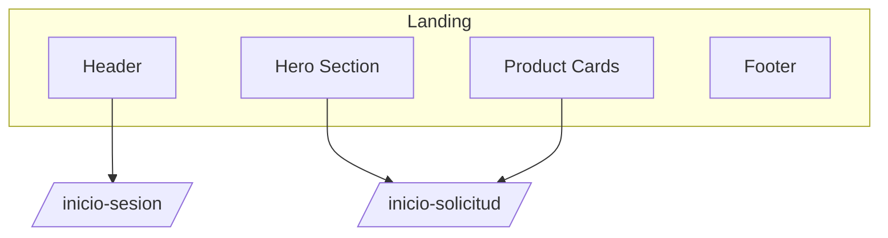

# HU-FB-001: Landing page

## Descripcion

**Como** visitante  
**Quiero** ver una pagina de inicio atractiva  
**Para** conocer los productos bancarios disponibles y navegar a las acciones principales

## Criterios de Aceptacion

| # | Criterio | Validacion |
|---|----------|------------|
| 1 | Muestra un hero section con mensaje principal | Componente visible en `/` |
| 2 | Presenta tarjetas de productos destacados | Seccion de productos |
| 3 | Incluye boton para iniciar solicitud | Navega a `/inicio-solicitud` |
| 4 | Incluye enlace para iniciar sesion | Navega a `/inicio-sesion` |
| 5 | El header muestra la marca del banco | Componente Header |

## Datos Tecnicos

**Ruta:** `/`

**Componentes:**
- Header
- Hero Section
- Product Cards
- Footer

## Diagrama de Navegacion

## Archivos Relacionados

- `src/app/(features)/(landing)/page.tsx`
- `src/shared/components/header/`
- `src/shared/components/footer/`
