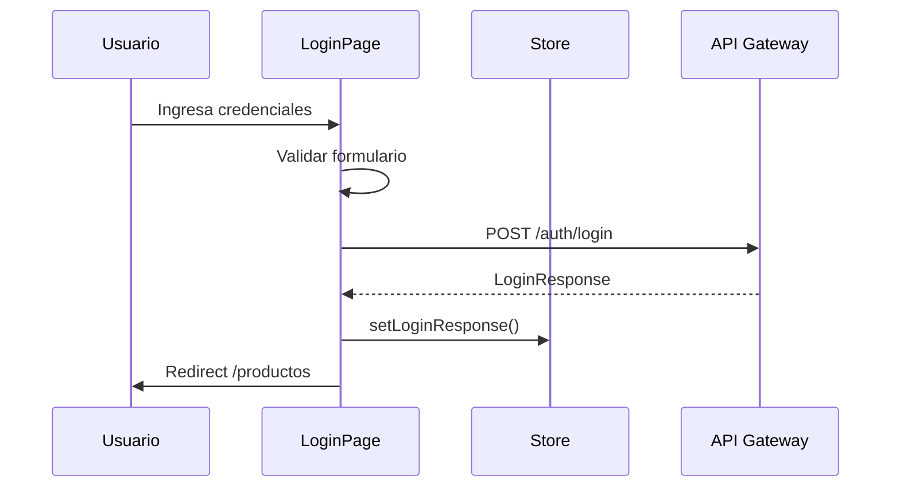

# HU-FB-002: Inicio de sesion

## Descripcion

**Como** usuario registrado  
**Quiero** iniciar sesion con mi cedula y contrasena  
**Para** acceder a mis productos bancarios

## Criterios de Aceptacion

| # | Criterio | Validacion |
|---|----------|------------|
| 1 | Muestra formulario con campos cedula y contrasena | Inputs validados |
| 2 | Valida que los campos no esten vacios | Mensaje de error |
| 3 | Envia credenciales al API Gateway | POST `/auth/login` |
| 4 | Guarda el token en el store de Zustand | `loginResponse.accessToken` |
| 5 | Redirige al dashboard de productos | Navega a `/productos` |

## Datos Tecnicos

**Ruta:** `/inicio-sesion`

**Store:**
```typescript
interface LoginFormState {
  documentNumber: string;
}

interface LoginResponseState {
  accessToken: string;
  fullName: string;
  userId: string;
  isRegistered: boolean;
}
```

**Validacion:**
- `documentNumber`: requerido
- `password`: requerido, minimo 8 caracteres

## Diagrama de Secuencia



## Archivos Relacionados

- `src/app/(features)/inicio-sesion/page.tsx`
- `src/app/(features)/inicio-sesion/services/`
- `src/shared/store/slices/form.slice.ts`
