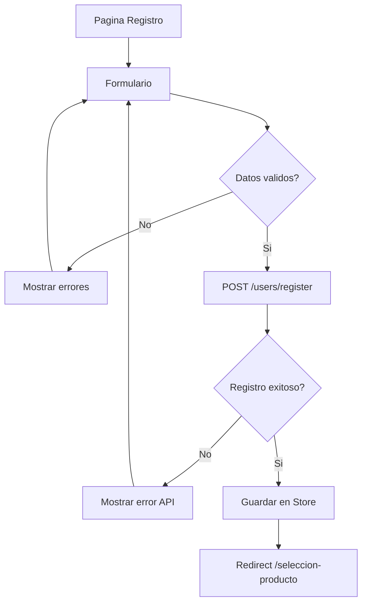

# HU-FB-003: Registro de usuario

## Descripcion

**Como** usuario nuevo  
**Quiero** registrarme en el sistema  
**Para** poder solicitar productos bancarios

## Criterios de Aceptacion

| # | Criterio | Validacion |
|---|----------|------------|
| 1 | Muestra formulario con datos personales | Nombre, ciudad, ingresos, contrasena |
| 2 | Valida formato de los campos | React Hook Form + Yup |
| 3 | Requiere contrasena de minimo 8 caracteres | Validacion client-side |
| 4 | Envia datos al API Gateway | POST `/users/register` |
| 5 | Redirige a seleccion de producto al completar | Navega a `/seleccion-producto` |

## Datos Tecnicos

**Ruta:** `/creacion-usuario`

**Store:**
```typescript
interface RegisterFormState {
  fullName: string;
  city: string;
  monthlyIncome: number | null;
}

interface RegisterResponseState {
  preClientId: string;
}
```

**Validacion:**
- `fullName`: requerido
- `city`: requerido
- `monthlyIncome`: requerido, numerico, >= 0
- `password`: requerido, minimo 8 caracteres

## Diagrama de Flujo



## Archivos Relacionados

- `src/app/(features)/creacion-usuario/page.tsx`
- `src/app/(features)/creacion-usuario/components/`
- `src/app/(features)/creacion-usuario/services/`
