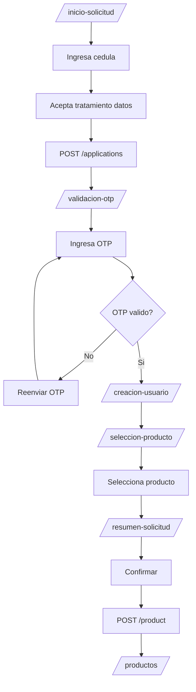

# HU-FB-004: Flujo de solicitud de producto

## Descripcion

**Como** usuario  
**Quiero** completar el flujo de solicitud de producto  
**Para** obtener un producto bancario (ahorro, credito o prestamo)

## Criterios de Aceptacion

| # | Criterio | Validacion |
|---|----------|------------|
| 1 | Inicia con formulario de cedula y aceptacion de datos | `/inicio-solicitud` |
| 2 | Valida codigo OTP de 6 digitos | `/validacion-otp` |
| 3 | Permite seleccionar tipo de producto | `/seleccion-producto` |
| 4 | Muestra resumen antes de confirmar | `/resumen-solicitud` |
| 5 | El estado persiste entre paginas | Zustand + sessionStorage |

## Datos Tecnicos

**Rutas del flujo:**
1. `/inicio-solicitud`
2. `/validacion-otp`
3. `/creacion-usuario`
4. `/seleccion-producto`
5. `/resumen-solicitud`

**Store:**
```typescript
interface ApplicationFormState {
  documentNumber: string;
  acceptsDataTreatment: boolean;
}

interface ProductSelectionState {
  selectedProductId: string | null;
}
```

## Diagrama de Flujo



## Archivos Relacionados

- `src/app/(features)/inicio-solicitud/`
- `src/app/(features)/validacion-otp/`
- `src/app/(features)/seleccion-producto/`
- `src/app/(features)/resumen-solicitud/`
