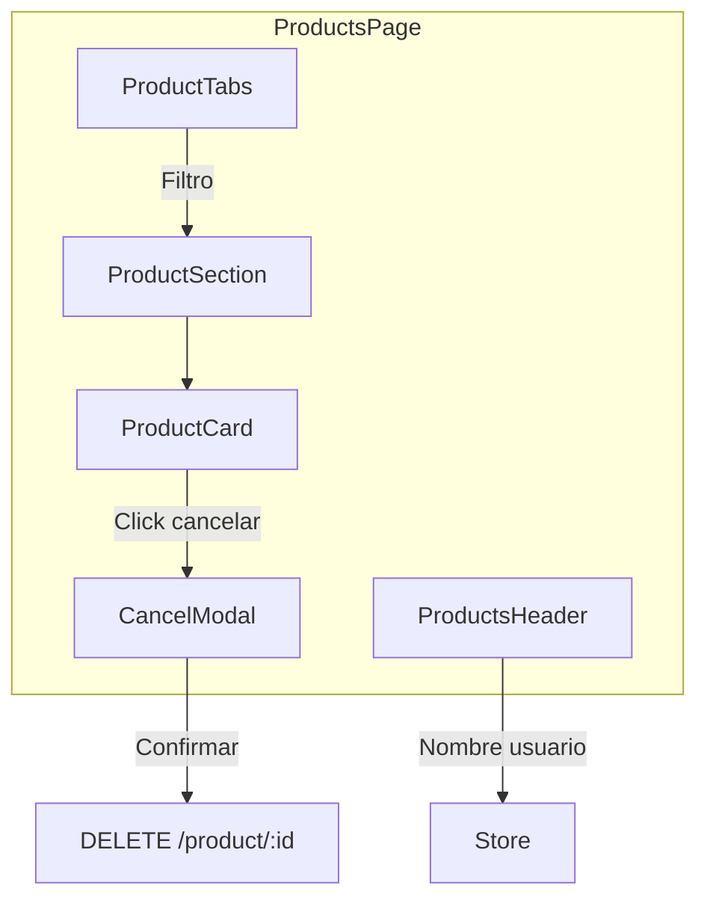

# HU-FB-005: Dashboard de productos

## Descripcion

**Como** usuario autenticado  
**Quiero** ver un dashboard con mis productos bancarios  
**Para** gestionar y consultar el estado de mis productos

## Criterios de Aceptacion

| # | Criterio | Validacion |
|---|----------|------------|
| 1 | Muestra header con nombre del usuario | Datos del store |
| 2 | Lista todos los productos del usuario | GET `/product/user/:userId` |
| 3 | Permite filtrar por tipo (ahorro, credito, prestamo) | Tabs de filtro |
| 4 | Muestra tarjeta con datos de cada producto | ProductCard |
| 5 | Permite cancelar productos | Modal de confirmacion |

## Datos Tecnicos

**Ruta:** `/productos`

**Tipos de producto:**
- `savings`: Cuenta de ahorro
- `credit`: Tarjeta de credito
- `loan`: Prestamo

**Estados de producto:**
- `active`: Activo
- `pending`: Pendiente
- `inactive`: Inactivo

## Diagrama de Componentes



## Estructura de Datos

```typescript
interface ProductResponseDto {
  id: string;
  name: string;
  type: 'savings' | 'credit' | 'loan';
  description?: string;
  accountNumber?: string;
  balance: string;
  limit?: string;
  status: 'active' | 'pending' | 'inactive';
  rate?: string;
  lastMovement?: string;
}
```

## Archivos Relacionados

- `src/app/(features)/productos/page.tsx`
- `src/app/(features)/productos/components/ProductsHeader/`
- `src/app/(features)/productos/components/ProductTabs/`
- `src/app/(features)/productos/components/ProductCard/`
- `src/app/(features)/productos/components/CancelProductModal/`
